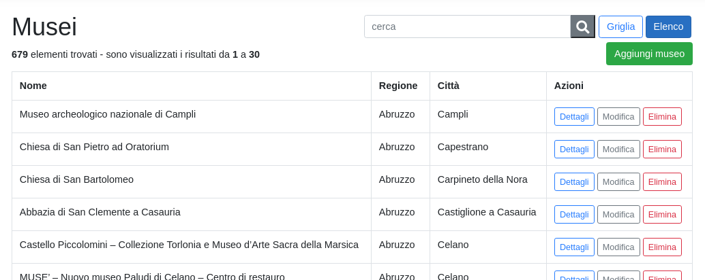

# PortaleMusei
Simple CRUD demo application, made with ASP.NET Core with Identity.  
It has 4 authentication levels:
- **guest**: can only see the news on the homepage (from [MuseiNews](https://github.com/cristianlivella/MuseiNews))
- **user**: can see the museums list and details
- **staff**: can add, edit and delete museums
- **admin**: can set user roles and lock out users

It includes 679 Italian museums!  
Made during school year 2019/2020 at [ITIS Paleocapa](https://itispaleocapa.edu.it).

## Screenshots

*Homepage with museums carousel and news*
***

*Museums cards*
***

*Museums list*
***

*Edit museum*
***

*Delete museum*
***

*User list*
***

*Edit user*
